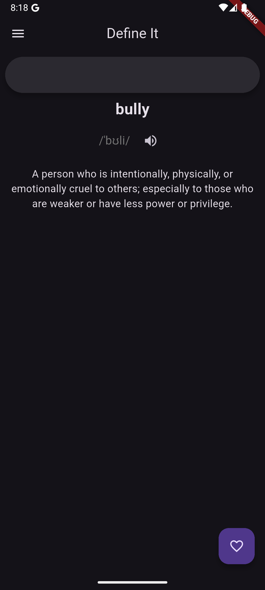
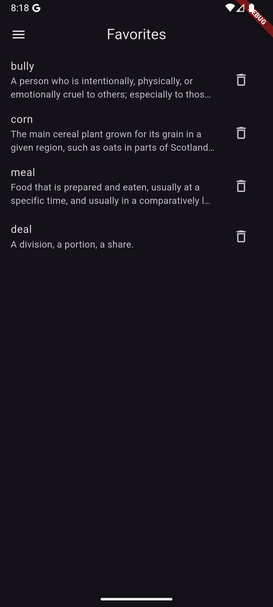
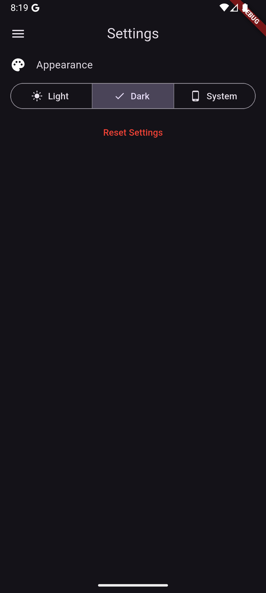

# Define It

A Flutter application for looking up word definitions with pronunciations, audio playback, and bookmarking capabilities.

## Features

- **Word Search** - Look up definitions for any word using a dictionary API
- **Audio Pronunciation** - Listen to word pronunciations with built-in audio playback
- **Bookmark Favorites** - Save your favorite words for quick access
- **Search History** - Keep track of recently searched words
- **Dark/Light Theme** - Toggle between dark and light modes
- **Offline Access** - Store bookmarked words in local SQLite database
- **Cross-Platform** - Built for iOS and Android

## Screenshots

| Home Screen | Bookmarks | Settings |
|---|---|---|
|  |  |  |

## Tech Stack

- **Framework**: Flutter 3.10.8+
- **State Management**: Provider
- **Database**: Floor + SQLite
- **API Requests**: HTTP
- **Audio**: AudioPlayers
- **Preferences**: Shared Preferences
- **Development Tools**: Build Runner, Floor Generator

## Project Structure

```
lib/
├── main.dart                 # App entry point
├── screens/                  # UI screens
├── database/                 # Local database
│   ├── dao/                  # Data Access Objects
│   └── entities/             # Database models
├── services/                 # Business logic
├── models/                   # Data models
├── providers/                # State providers
└── widgets/                  # Reusable components
```

## Getting Started

### Prerequisites

- Flutter SDK
- Dart SDK included with Flutter
- An IDE (VS Code, Android Studio, or Xcode)

### Installation

1. **Clone the repository**
   ```bash
   git clone https://github.com/Mango182/define-it.git
   cd define-it/define_it
   ```

2. **Install dependencies**
   ```bash
   flutter pub get
   ```

3. **Generate Floor database code**
   ```bash
   dart run build_runner build --delete-conflicting-outputs
   ```

4. **Run the app**
   ```bash
   flutter run
   ```

## Building for Release

### Android
```bash
flutter build apk --release
# or for app bundle
flutter build appbundle --release
```

### iOS
```bash
flutter build ios --release --no-codesign
```
For installable iOS builds, Apple code signing is required.

## Key Dependencies

| Package | Purpose |
|---------|---------|
| `provider` | State management |
| `floor` | ORM for SQLite database |
| `http` | HTTP requests for API calls |
| `audioplayers` | Audio playback |
| `shared_preferences` | Simple key-value storage |
| `fluttertoast` | Toast notifications |

## Database Schema

The app uses Floor ORM with SQLite. Key entities:

- **FavoriteWord** - Stores user's bookmarked words with definitions
- **SearchedWord** - Tracks search history

## Configuration

### Theme Settings
The app supports automatic theme switching. Configure theme preferences in:
- `lib/providers/theme_provider.dart`

### App Icons
Update app icons using flutter_launcher_icons:
```bash
flutter pub run flutter_launcher_icons:main
```

See `flutter_launcher_icons.yaml` for icon configuration.

## Debugging

### SQLite Database Inspector
The app includes SQLite Inspector for debugging the local database in development mode:
```dart
if (kDebugMode) {
  await SqliteInspector.start();
}
```

Access it at: `http://localhost:8080` during app development

## API Integration

The app connects to a dictionary API to fetch word definitions. Configure API endpoints in:
- `lib/services/dictionary_api.dart`

## Troubleshooting

### Build Issues
If you encounter build issues:
```bash
flutter clean
flutter pub get
flutter pub run build_runner build --delete-conflicting-outputs
```

### Database Issues
If the database is corrupted or needs reset:
1. Uninstall the app
2. Run `flutter clean`
3. Rebuild and run the app

## Performance Tips

- The app caches recent searches for faster access
- Audio files are streamed directly without full download
- Database queries are optimized with proper indexing
- Provider ensures efficient UI rebuilds

## Version 

Current Version: 1.0.0

## License

This is a personal project. All rights reserved.

## Support

For issues, suggestions, or bugs, please open an issue in the repository.

---

## Credits
- **App Icon Artwork** - Created by [ChristM103](https://github.com/christM103)